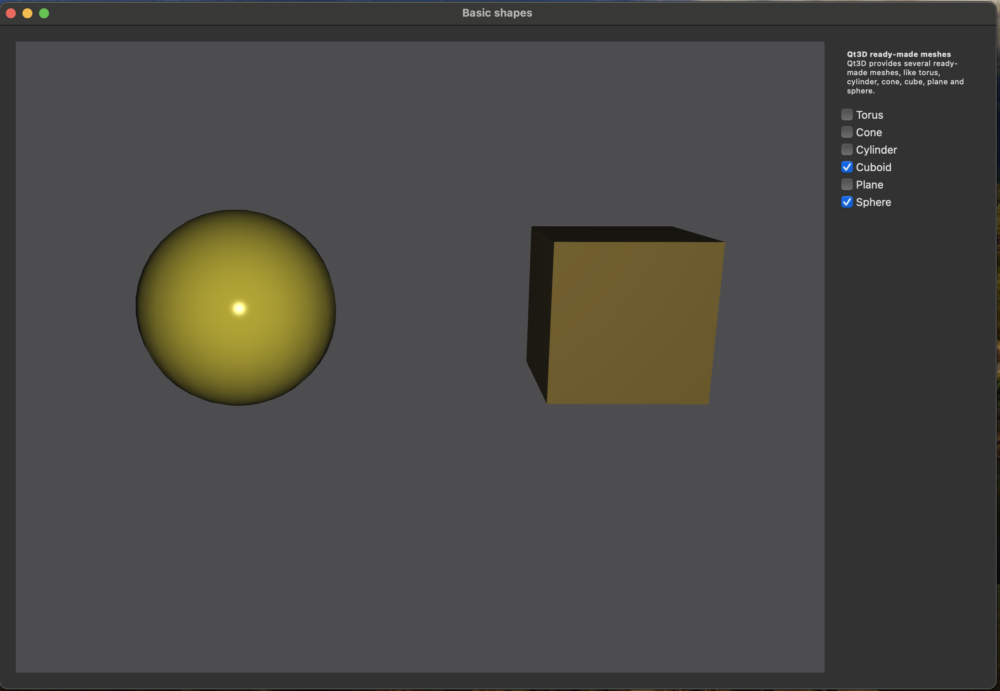

# Qt6 GUI cmake hello world
A simple project setup for a Qt6 cmake build. this project prefers using homebrew to install qt as using Qt creator made it
hard to build using cmake, because cmake could not easily find it or the setup was a bit too involved for my liking.
